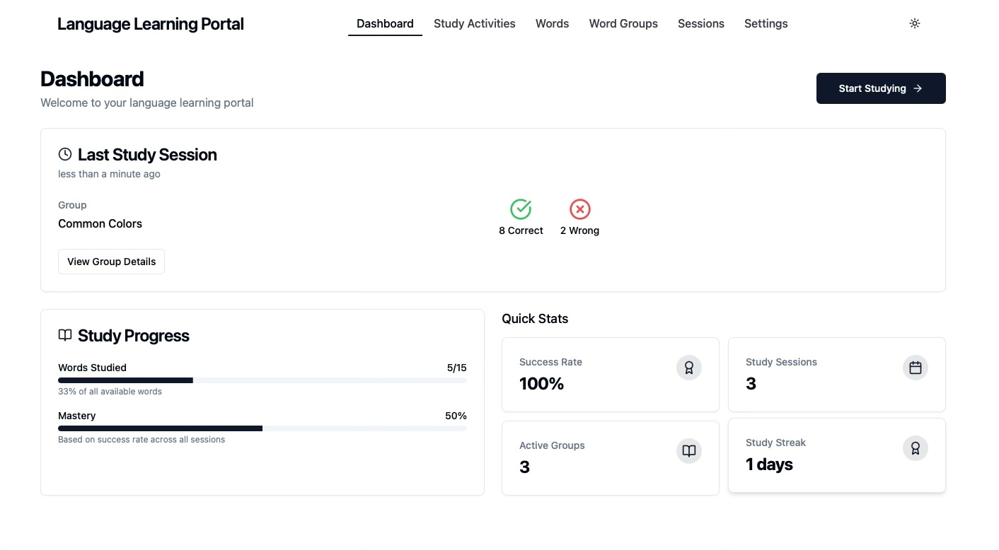

# Language Learning Portal Frontend



## Project info

This is the frontend for the Language Learning Portal.

It was bootstrapped using Lovable and further tuned/developed both manually and with AI help using Cursor/Windsurf to ensure correct integration with the backend.

## How to run the project

The only requirement is having Node.js & npm installed - [install with nvm](https://github.com/nvm-sh/nvm#installing-and-updating)

Follow these steps:

```sh
# Step 1: Install the necessary dependencies.
npm i

# Step 2: Start the development server with auto-reloading and an instant preview.
npm run dev
```


## What technologies are used for this project?

This project is built with .

- Vite
- TypeScript
- React
- shadcn-ui
- Tailwind CSS

## API Configuration

The application can be configured to use either a mock API or a real backend API. This is controlled by the `useMockApi` setting in `src/lib/config.ts`.

```typescript
// src/lib/config.ts
const config = {
  useMockApi: false, // Set to true to use mock data, false to use real API
  baseUrl: "http://localhost:3000/api", // Base URL for the real API
};

export default config;
```

To switch between using the real backend API and mock data:

1. Open `src/lib/config.ts`
2. Set `useMockApi` to `false` to use the real backend API
3. Set `useMockApi` to `true` to use mock data
4. Ensure `baseUrl` is set to the correct URL of your backend API

The backend API is expected to return data in the following format for paginated endpoints:

```json
{
  "items": [
    // Array of items (words, groups, etc.)
  ],
  "pagination": {
    "current_page": 1,
    "total_pages": 5,
    "total_items": 100,
    "items_per_page": 20
  }
}
```

## API Client

The application uses an API client to communicate with the backend. The API client is located in `src/lib/apiClient.ts`.

The API client provides methods for all the API endpoints used by the application, such as:

- `getWords()` - Get a list of words
- `getWord(id)` - Get a specific word
- `getGroups()` - Get a list of groups
- `getGroup(id)` - Get a specific group
- `getGroupWords(id)` - Get a list of words in a group
- `addWordsToGroup(groupId, wordIds)` - Add words to a group (expects an array of word IDs directly)
- `getStudyActivities()` - Get a list of study activities
- `getStudyActivity(id)` - Get a specific study activity
- `getStudyActivitySessions(id)` - Get a list of study sessions for a study activity
- `launchStudyActivity(study_activity_id, group_id)` - Launch a study activity
- `getStudySession(id)` - Get a specific study session
- `getStudySessions(page)` - Get a paginated list of study sessions
- `resetStudySession(id)` - Reset a study session
- `submitAnswer(sessionId, wordId, isCorrect)` - Submit an answer for a word in a study session
