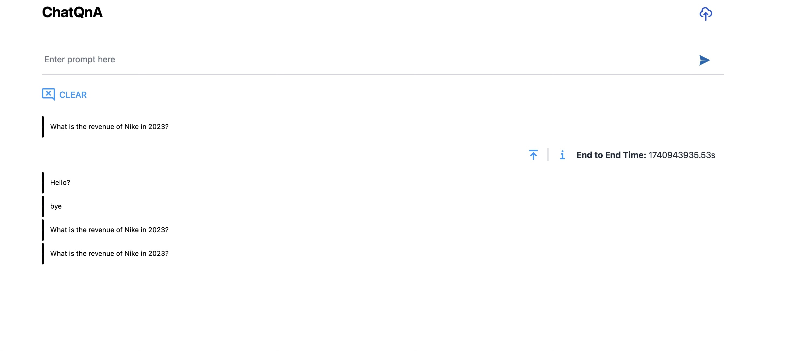

# Description

Modified/copied from https://opea-project.github.io/latest/GenAIExamples/ChatQnA/docker_compose/nvidia/gpu/README.html to be executed on an on-premise Nvidia GPU.

## Current Status

- All services run. No errors are logged
- But when sending a message either via curl (see ) or using the UI no message is received back
- Since I've already spent more time on this than I should, I'm going to move on to other things.
- To investigate later....



## Prerequisites


1. Make sure to have access to the `meta-llama/Meta-Llama-3-8B-Instruct` model in Hugging Face.


## Running steps

Set the required environment variables:

```
# Example: host_ip="192.168.1.1"
export host_ip="External_Public_IP"
export HUGGINGFACEHUB_API_TOKEN="Your_Huggingface_API_Token"
```

Source the environment variables:

```bash
source ./set_env.sh
```

Run the docker compose file:

```bash
docker compose up -d
```

Wait for the services to start.

Finally the UI should be available at http://<host_ip>:5173
And can also be tested with curl:


```bash
curl http://${host_ip}:8888/v1/chatqna \
    -H "Content-Type: application/json" \
    -d '{
        "messages": "What is the revenue of Nike in 2023?"
    }'
```

I only get the output:

```bash
data: [DONE]
```

But was expecting some kind of response from the model...
